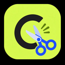

<p align="center">
  
</p>

# Clipclap

Local-first Chromium extension that clips a page or selection, optionally rewrites it with your OpenRouter API key, and saves the result as a file in a folder you choose.

No Clipclap backend.
No account.
No telemetry.
Your OpenRouter API key, clips, and saved files stay on your device (aside from the rewrite request you choose to send to OpenRouter).

Install from the Chrome Web Store.
That listing is the supported way to install and update Clipclap.

## Why it exists

Clipclap is a **clipper**, not an Obsidian plugin.

v1 writes simple local files (Markdown or plain text) into any folder you grant via the File System Access API.
It is tested with Obsidian vaults, but any app that can open `.md` or `.txt` files works the same way.

## Features

- Clip via context menu or shortcuts (`Alt+Shift+C` page, `Alt+Shift+S` selection)
- Rewrite / edit / save in a dedicated review window
- Tone harnesses, searchable model picker, optional auto rewrite / auto save
- Save as Markdown (`.md` with YAML attributes) or Plain text (`.txt`).
- Rewrites follow the selected format
- Unique filenames only (never overwrites existing files)
- Masked, non-copyable OpenRouter API key after save
- Pictures and videos become lightweight links (modest image URLs, watch/poster links) - not copied files or high-res binaries

## Roadmap

- [x] Chromium extension + local folder saves
- [x] Markdown files with YAML attributes
- [x] Plain text save + matching rewrite prompts
- [ ] Additional browsers (Firefox and others)
- [ ] More note destinations beyond a local folder
- [ ] Direct support for other AI providers (beyond OpenRouter)
- [ ] Richer templates without locking to one note app

Direction: stay local-first and destination-agnostic, whether you keep notes in a vault, a git repo, or a plain folder.

## Requirements

- Chromium browser (Chrome, Edge, Brave, and similar)
- An [OpenRouter](https://openrouter.ai/) API key (v1 talks only to OpenRouter; keys from OpenAI, Anthropic, Google, and other providers do not work yet)
- A local save folder you control

New to OpenRouter?
See [OPENROUTER.md](OPENROUTER.md) for signup, creating a key, credits, and pasting it into Clipclap.

## How to clip

| Action | How |
| --- | --- |
| Clip page | Right-click → **Clip page with Clipclap**, or `Alt+Shift+C` |
| Clip selection | Right-click → **Clip selection with Clipclap**, or `Alt+Shift+S` |

A rewrite window opens so you can rewrite, edit, save, copy, or dismiss.

Images and videos in the clip become markdown (or plain-text) references: a modest image URL from `srcset` when available, or a watch/poster link for embeds.
Clipclap does not download, embed, or rewrite media binaries.

## Save formats

### Markdown (default)

Writes `title-slug.md` with YAML attributes and optional citation.
If that name exists, Clipclap writes `title-slug-1.md` instead of overwriting.

```markdown
---
title: "React Server Components"
source: "https://example.com/…"
site: "example.com"
clipped: 2026-08-20
tone: compact
tags:
  - clipclap
---

# React Server Components

Rewritten content…

## Citation
"React Server Components." example.com. https://example.com/…. Accessed 20 Aug 2026.
```

### Plain text

Writes `title-slug.txt` without frontmatter or Markdown structure.
The rewrite prompt asks the model for plain text so the body matches the file type.

## Privacy

| Data | Where it lives | Who receives it |
| --- | --- | --- |
| OpenRouter API key | Extension storage on your device | OpenRouter when you rewrite |
| Settings | Extension storage | Nobody else |
| Save-folder permission | IndexedDB (File System Access handle) | Local only |
| Last clip / status | Session storage | Local only |
| Saved files | The folder you chose | Local only |

Clipclap does not run analytics or telemetry, require an account, read beyond the folder you grant, or overwrite existing files in that folder.

See [SECURITY.md](SECURITY.md) for reporting issues.

## Permissions (why they exist)

- `activeTab` / `scripting` / host access - extract the page or selection you clip
- `storage` - settings and last clip on device
- `contextMenus` - right-click clip actions
- `sidePanel` - settings UI
- `windows` - rewrite review window
- Network to OpenRouter - rewrite only when you ask (or when auto-rewrite is on)

## Contributing

Clipclap should keep getting better.
The Chrome Web Store extension is what users install; this repo is where we grow it.

Ideas, issues, and pull requests welcome: [CONTRIBUTING.md](CONTRIBUTING.md).

## License

MIT - see [LICENSE](LICENSE).
